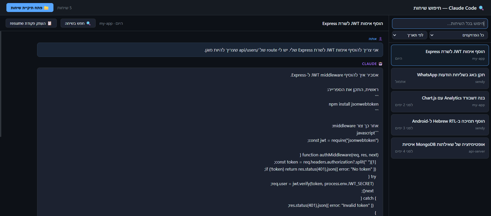
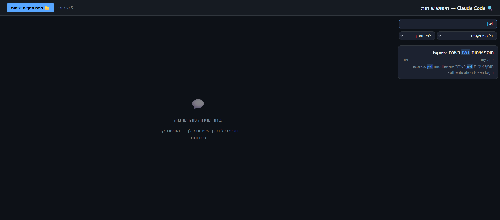
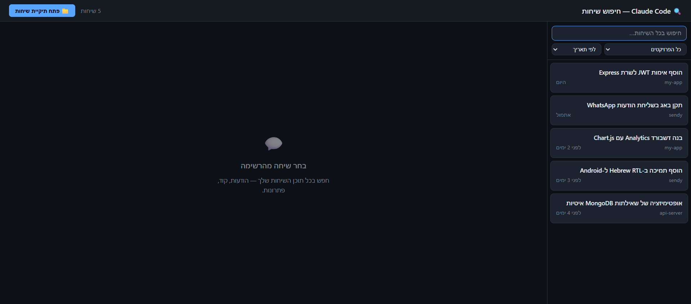
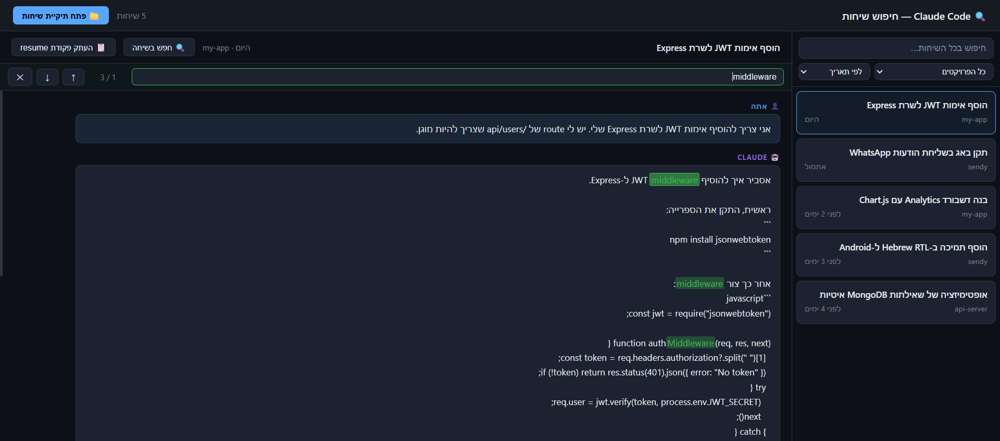

# Claude Code History Search

> Search through all your Claude Code conversation history — no installation required.

A single HTML file. Open it in Chrome or Edge, pick your `.claude/projects` folder, and instantly search across every conversation you've ever had with Claude Code.



---

## Why this exists

Claude Code saves all conversations locally as JSONL files in `~/.claude/projects/`, but the VS Code extension only lets you search by **conversation title** — not by content.

This tool gives you **full-text search** across everything: your questions, Claude's answers, code snippets, file names, error messages — all of it.

---

## Compared to other tools

| Tool | Requires |
|---|---|
| **This tool** | Open an HTML file in Chrome ✅ |
| claude-code-history-viewer | Install a desktop app (.exe) |
| claude-history | Python or Node CLI |
| claude-code-chat-explorer | `npm install` + run a local server |

---

## Requirements

- **Chrome** or **Edge** (uses the [File System Access API](https://developer.chrome.com/docs/capabilities/web-apis/file-system-access))
- **Firefox** is not supported

---

## How to use

1. **Download** [`index.html`](index.html) (just the one file)
2. **Open** it in Chrome or Edge
3. Click **"פתח תיקיית שיחות"** (Open conversations folder)
4. Navigate to your `.claude/projects` folder:
   - **Windows:** `C:\Users\<your-name>\.claude\projects`
   - **Mac/Linux:** `~/.claude/projects`
5. Click **Select Folder**

All your conversations load in seconds.

---

## Features

### Search across all conversations
Type anything — code, error messages, keywords, Hebrew or English — and instantly see matching conversations with highlighted snippets.



### Filter by project
Each Claude Code project gets its own folder. Filter to see only conversations from a specific repo.

### Sort by date or relevance
- **By date** — most recent first (default)
- **By relevance** — most matching occurrences first

### Full conversation viewer
Click any result to read the full conversation with highlighted matches.



### In-conversation search
Search within the open conversation using the **"🔍 חפש בשיחה"** button or **Ctrl+F**.
Navigate between matches with ↑ ↓ buttons or Enter / Shift+Enter.



### Resume a conversation
Click **"📋 העתק פקודת resume"** to copy `claude --resume <session-id>` to your clipboard. Paste it in your terminal to continue the conversation in Claude Code.

---

## Where Claude Code stores conversations

```
~/.claude/projects/
  <project-name>/
    <session-id>.jsonl   ← one file per conversation
    ...
```

The project folder name is the project path with `\` replaced by `--`  
(e.g. `c--Users-John-Documents-GitHub-my-app`).

---

## Privacy

Everything runs **100% locally** in your browser. No data is sent anywhere. No server. No analytics.

---

## License

MIT
